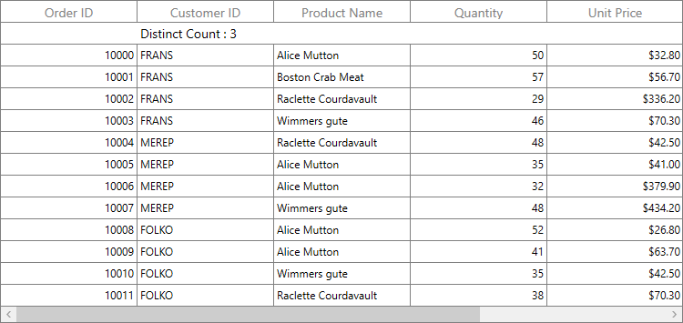

# How to display distinct count of a column values in table summary row of WPF DataGrid (SfDataGrid)?

# About the sample

This example illustrates how to display distinct count of a column values in table summary row of DataGrid.

[WPF DataGrid](https://www.syncfusion.com/wpf-ui-controls/datagrid) (SfDataGrid) provides support to add summary to display Count, Max, Min, Average and Sum of the records by default. There is no direct aggregate type to display distinct count value of the records.  However, it is possible to display distinct count in the summary row by using [GridSummaryColumn.CustomAggregate](https://help.syncfusion.com/cr/wpf/Syncfusion.UI.Xaml.Grid.GridSummaryColumn.html#Syncfusion_UI_Xaml_Grid_GridSummaryColumn_CustomAggregate) property.

```C#

this.dataGrid.TableSummaryRows.Add(new GridTableSummaryRow()
{
    ShowSummaryInRow = false,
    Position = TableSummaryRowPosition.Top,
    SummaryColumns = new ObservableCollection<ISummaryColumn>()
    {
       new GridSummaryColumn()
       {
          Name = "CustomerID",
          MappingName="CustomerID",
          CustomAggregate=new CustomAggregate(),
          SummaryType=SummaryType.Custom,
          Format="Distinct Count : {DistictCount}"
       },
    }
});


namespace SfDataGrid_MVVM
{
    public class CustomAggregate : ISummaryAggregate
    {
        public CustomAggregate()
        {
        }

        public double DistictCount { get; set; }

        public Action<System.Collections.IEnumerable, string, System.ComponentModel.PropertyDescriptor> CalculateAggregateFunc()
        {
            return (items, property, pd) =>
            {
                var enumerableItems = items as IEnumerable<OrderInfo>;

                if (pd.Name == "DistictCount")
                {
                    this.DistictCount = enumerableItems.DistictCount<OrderInfo>(q => q.CustomerID);
                }
            };
        }
    }

    public static class LinqExtensions
    {
        static List<string> list = new List<string>();

        public static double DistictCount<T>(this IEnumerable<T> values, Func<T, string> selector)
        {
            double ret = 0;
            var count = values.Count();
            foreach (var value in values)
            {
                if (!list.Contains((value as OrderInfo).CustomerID))
                {
                    list.Add((value as OrderInfo).CustomerID);
                }
            }
            ret = list.Count;
            return ret;
        }
    }
}

```



Take a moment to peruse the [documentation](https://help.syncfusion.com/wpf/datagrid/summaries), where you can find about Summaries in SfDataGrid, with code examples.

## Requirements to run the demo

Visual Studio 2015 and above versions.
